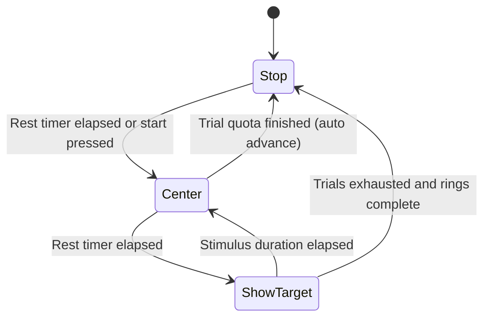

# Data Streams, Sensors, and Tooling

This guide documents how runtime data leaves the application (Lab Streaming Layer, file logs), how eye-tracking and calibration subsystems work, and which companion utilities support experiments.

## Lab Streaming Layer (LSL) Inventory
| Stream Name | Origin | Channels / Payload | Notes |
| --- | --- | --- | --- |
| `EventMarker` | `Assets/LSLStreamer.cs` | 1 x string | Generic event log; used by `HighlightItemController`, `HintController`, `GoalDetector`, etc. |
| `TimerStream` | `Assets/LSLStreamer.cs` | 1 x float32 | Continuous timers (for example search durations). |
| `TestMarker` | `Assets/EscapeRoom_PuzzleManager.cs` | 1 x string | Disk puzzle state changes and heatmap toggles. |
| `GrabMarker` | `Assets/GrabStreamer.cs`, `Assets/GrabStreamerPuzzle.cs` | 1 x string | Hand/object grab events; includes teleport start/end when wired. |
| `BulletMarker` | `Assets/Scripts/Spawn_Bullets_In_Order.cs` | 1 x string | Bullet spawn coordinates for the countdown trial. |
| `SurveyReport` | `Assets/Scripts/SurveyController.cs` | 1 x string | Survey submissions (mood, intensity, experience, flow). |
| `TimerStream` | `Assets/Scripts/HighlightItemController.cs` | 1 x float32 | Search-phase timer (forwarded through `LSLStreamer`). |
| `ProEyeGaze` | `Assets/Scripts/ProEyeGazeVST.cs` | 39 x float32 @ 50 Hz | Comprehensive gaze bundle (2D/3D gaze, head/chest velocities, openness, heatmap exploration percent, pupil diameters). |
| `ProEyeMarker` | `Assets/Scripts/LightDir.cs` | 1 x string | Object names under gaze focus. |
| `ProEyeGaze` (legacy) | `Assets/Scripts/GameGazeNew.cs` | 4 x float32 @ 90 Hz | Raw pupil positions from SRAnipal without positional context. |
| `KeyboardStream` | `keyboard_stream.py` | 1 x string | Pressed keyboard key names from the desktop companion app. |
| `GrabMarker` (Python) | `gui2.py`, `gui_audio_only.py` | 1 x string | Controller trigger state mirrored from OpenVR through pylsl. |
| `ScreenPosition` | `Assets/Scripts/ScreenPositionRecorder.cs` | 7 x float32 @ 90 Hz | Stereo-normalized gaze coordinates plus pupil diameters and timestamp; emitted alongside `PLREventMarker`. |
| `PLREventMarker` | `ScreenPositionRecorder` | 1 x string | Flags the start of a pupil-light reflex trial. |
| `Controller` | `Assets/Scripts/CalibrationTaskManager.cs` | 6 x float32 | Left/right controller positions captured during calibration sequences. |

When adding new instrumentation, keep stream names stable and update this table. All LSL outlets live in the `liblsl.StreamOutlet` space; ensure the `Assets/Scripts/LSL.cs` shim is present in builds.

## Eye-Tracking Stack
### ProEyeGazeVST (`Assets/Scripts/ProEyeGazeVST.cs`)
- Supports two data sources:
  - **HTC Vive Pro Eye** via SRAnipal (`ViveSR.anipal.Eye`).
  - **HP Omnicept** when `DataSource.HPOmnicept` is selected and a `GliaBehaviour` instance is present.
- Registers optional SRAnipal callbacks to retrieve pupil diameters (`EyeCallback`).
- Each `Update()` step:
  1. Queries gaze origin/directions for left, right, and combined eyes.
  2. Raycasts forward from `lighter` (eye proxy) to find the scene hit point.
  3. Logs to disk (`C:\{folderName}\ProEyeData_*.txt`) with timestamped metrics.
  4. Computes chest tracker pose (using `TrackingMap` to map Vive trackers to body joints when available).
  5. Feeds gaze points into the volumetric `Heatmap` (see below) and normalizes against `heatMapThreshold`.
  6. Streams the 39-element float payload over LSL (see table above).
- `TrackingMap` pairs physical trackers with rig targets so body pose data aligns with the recorded gaze frames.

### Legacy Gaze Recorders
- `GameGaze.cs`: Talks to the `aGlass` SDK, writing gaze to `C:\EscapeRoomData`. Mostly replaced by SRAnipal but still present in legacy scenes.
- `GameGazeNew.cs`: Lightweight SRAnipal recorder streaming only the 2D pupil positions.
- `LightDir.cs`: Performs a forward raycast from the eye proxy, logs object names to a file, and streams `ProEyeMarker` updates. Material highlighting hooks exist but are currently commented out.

## Volumetric Heatmap and Splotches
### `Heatmap.cs`
- Attached to a camera, creates a `Texture3D` storing cumulative gaze intensity.
- Shader uniforms (`_HeatData`, `startX/Y/Z`, `stepX/Y/Z`, `sizeX/Y/Z`) describe the volume grid.
- `GazeAt(Vector3 gip, float dt)` iterates over cells inside `affectingRadius`, applies a falloff ratio `1 - distance^3 / affectingRadius`, and increases each voxel by `ratio * rate * dt`.
- When `enableHeatmap` toggles or `forceUpdate` is true, the texture uploads to the GPU and the post effect applies.
- Toggle rendering via `SetHeatmap(bool)`; the script passes source frames through unchanged when disabled.

### `EyeHeapmapsManager.cs` and `HeatColorObject.cs`
- `EyeHeapmapsManager` raycasts from `GazeTransform` every `timer` seconds; on a hit it instantiates `HeatColorObject` markers.
- Each `HeatColorObject` counts overlapping colliders tagged `Heat` and remaps counts to translucent colours (green toward red). This is useful for quick debugging of gaze clusters without the heavier 3D heatmap.

## Calibration, SSVEP, and PLR Stimuli
### State Machine Overview
- **Controller**: `Assets/Scripts/CalibrationTaskManager.cs`.
- **Dependent cues**: `SSVEPCue`, `SSVEPCueNew` + `Flicky`, `PLRCue`, arrow and sign prefabs, dropdown-driven modes.
- **Modes**: ERP trials, SSVEP (arrow/quad), PLR (pupil light reflex), optional two-step sequences that introduce `SecondCube`.
- **Timing knobs**: `duration`, `rest_duration`, `trial_count`, `odd` (target probability), per-cue offsets.

- During `ShowTarget`, the manager randomly selects a cube in the current ring, toggles its SSVEP flicker (`SSVEPCue` or `SSVEPCueNew`/`Flicky`), optionally lights PLR halos, and positions target/deviant signs. Metadata (`ring`, `trial`, cube index, frequency, position) is sent over `EventMarker`.
- Controller dropdowns (`dropdown_mode`, `dropdown_plr_mode`) choose which branch executes. In two-step mode, `SecondCube` shows an additional cue offset by `distance` metres.
- Baseline PLR sequences use `BaselineState` to cycle rest, flicker, and PLR cues while respecting the oddball probability (`odd`).
- The manager also emits `"2D enabled"` or `"2D disabled"` when switching planar displays for screen-based observers.

### Cue Implementations
- `SSVEPCue`: Simple on/off colour flicker using per-object material instances.
- `SSVEPCueNew` plus `Flicky`: GPU-driven sinusoidal flicker with adjustable modulation frequency, duty cycle, and colours.
- `PLRCue`: Modulates halo light intensity or SSVEP brightness to induce pupil responses. Uses `accumTime` against `step = 1 / frequency` to time on/off windows and pushes dedicated markers via `CalibrationTaskManager.SendPLRMarker`.

## Replay and Analytics
- **Scripts**: `Assets/Scripts/Replay/ReplayManager.cs` with the `Assets/Scripts/UniqueID` helpers.
- **Recording pipeline**:
  1. Enumerates all `UniqueID` components and builds a parallel `frameList` (one list per object).
  2. On each recording frame, captures `timestamp`, `position`, and `rotation` for changed objects and appends to binary chunks using a custom `BinaryFormatter` with `Vector3`/`Quaternion` surrogates.
  3. Writes `.dem` files (for example `Assets/Scripts/Replay/Replay.dem`).
- **Replay pipeline**:
  - Loads frames, rewinds transforms to recorded states via linear interpolation between the nearest bracketing frames, and optionally forces rigidbodies into kinematic mode to avoid physics feedback.
  - UI elements (`Slider`, `Text`) expose play/pause/stop and playback speed.
- Ensure every object you want to capture has a `UniqueID` component (GUID serialized with the prefab). Maintain GUID uniqueness to avoid replay collisions.

## Surveys and On-Screen Control Panels
- `SurveyController` manages up to three panel prefabs, writes to `C:\EscapeRoomData\SurveyRecord_*.txt`, and sends `SurveyReport` markers. Use `whichToEnable` to select the active panel and `toggle(bool)` to open or close.
- `INC_inGameControl` orchestrates survey cadence and gaze telemetry displays. It polls `SurveyController`/`LightDir`, delays panel reappearance using `lapsTime`, and mirrors current state on UI labels (countdown, status, latest answers).
- `MenuPopoutButton` and `dropdownValChangeTrigger` provide simple UI toggles for spectator cameras and VR menus; wire them to `SpectatorController` components in scenes.

## Desktop Companion Utilities (Python)
- `gui2.py`: Kivy app that initializes OpenVR, monitors controller trigger analog values, pushes LSL markers, and plays breathwork audio when both triggers are held for `time_threshold` seconds. Displays trigger state via a tiny RGB texture.
- `gui_audio_only.py`: Slim variant focused on audio playback with an optional second track.
- `keyboard_stream.py`: Polls the Windows keyboard driver (`GetKeyNameTextW`), publishes pressed keys via LSL, and optionally renders the active keys with live FPS.
- All scripts expect pylsl, OpenVR, Kivy, and keyboard packages. They default to 250 Hz polling and small desktop windows; adjust thresholds to match experiments.

## Additional Instrumentation
- `ScreenPositionRecorder`: Projects a world-space gaze target into both stereo camera planes, logs normalized coordinates plus pupil diameters to CSV, and streams `ScreenPosition`/`PLREventMarker`.
- `FixationsVisualizer`: Parses fixation CSV logs and spawns colour-coded spheres whose alpha/intensity scales with fixation duration. Set `scale` to convert CSV units to scene units.
- `RespawnController`: Resets objects to their initial pose or respawns them using `ItemSpawner` when they hit a named trigger volume?useful for keeping trial objects in play.

Keep this document updated when adding new data channels, scripting new calibration paradigms, or changing log file locations so experiment operators can configure their tooling correctly.
